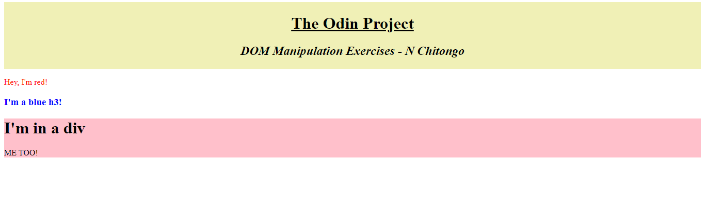

# DOM-Manipulation-Exercise

## Project Description 

This project is a solution to the first exercise on DOM Manipulation from a website called [THE ODIN PROJECT](https://www.theodinproject.com/paths/foundations/courses/foundations/lessons/dom-manipulation)

## Screenshot

## Built With

- Html
- JavaScript

## Live Demo

[Live Demo Link](https://natashac18.github.io/DOM-Manipulation-Exercise/)

## Tested With

Live Server

## Getting Started

To get a local copy up and running follow these simple steps.
### Prerequisites
- A Code Editor of your choice

### To clone the repo to your local repository:
`https://github.com/natashac18/DOM-Manipulation-Exercise.git`

`cd DOM-Manipulation-Exercise`

Open index.html in your preferred browser

## Author

:bust_in_silhouette: **Natasha Chitongo** 

GitHub: [@natashac18](https://github.com/natashac18)

## Show your support! 

If you like this project, please give it a :star: !

